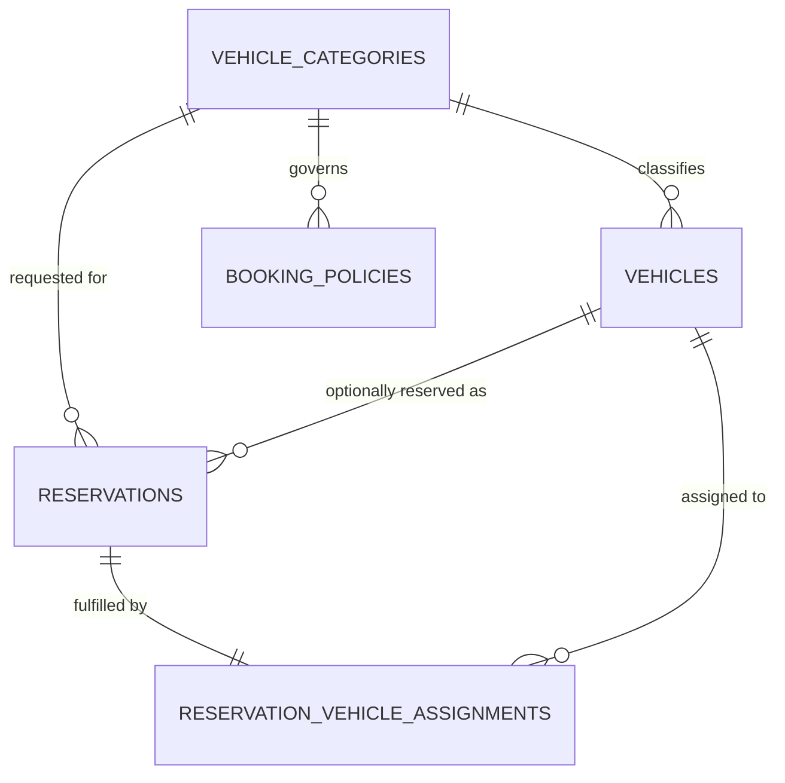

# Database Design - Car Management Vehicle Type Booking

## Table of Contents
- [vehicle_categories](#vehicle_categories)
- [vehicles](#vehicles)
- [booking_policies](#booking_policies)
- [reservations](#reservations)
- [reservation_vehicle_assignments](#reservation_vehicle_assignments)

## Entity Relationship Diagram

## Tables

### vehicle_categories
| Field | Data Type | Index | Constraints | Description |
| --- | --- | --- | --- | --- |
| id | UUID | Primary Key | NOT NULL, UNIQUE | Unique identifier of the vehicle category/class |
| name | TEXT | Index | NOT NULL, UNIQUE | Category/class name (e.g., Economy, SUV, Luxury) |
| description | TEXT | - | - | Description of the category/class |
| created_at | TIMESTAMP WITH TIME ZONE | - | NOT NULL | Record creation timestamp |
| updated_at | TIMESTAMP WITH TIME ZONE | - | NOT NULL | Record last update timestamp |
| deleted_at | TIMESTAMP WITH TIME ZONE | - | - | Record soft-delete timestamp |
| created_by | TEXT | - | NOT NULL | User who created the record |
| updated_by | TEXT | - | NOT NULL | User who last updated the record |
| deleted | BOOLEAN | - | NOT NULL, DEFAULT false | Soft-delete flag |

### vehicles
| Field | Data Type | Index | Constraints | Description |
| --- | --- | --- | --- | --- |
| id | UUID | Primary Key | NOT NULL, UNIQUE | Unique identifier of the vehicle |
| vehicle_category_id | UUID | Foreign Key (vehicle_categories.id) | NOT NULL | Category/class the vehicle belongs to |
| vin | TEXT | Index, Unique | NOT NULL, UNIQUE | Vehicle identification number |
| plate_number | TEXT | Index, Unique | NOT NULL, UNIQUE | License plate number |
| status | TEXT | Index | NOT NULL | Current vehicle status (available, reserved, rented, cleaning, maintenance, damaged, retired) |
| created_at | TIMESTAMP WITH TIME ZONE | - | NOT NULL | Record creation timestamp |
| updated_at | TIMESTAMP WITH TIME ZONE | - | NOT NULL | Record last update timestamp |
| deleted_at | TIMESTAMP WITH TIME ZONE | - | - | Record soft-delete timestamp |
| created_by | TEXT | - | NOT NULL | User who created the record |
| updated_by | TEXT | - | NOT NULL | User who last updated the record |
| deleted | BOOLEAN | - | NOT NULL, DEFAULT false | Soft-delete flag |

### booking_policies
| Field | Data Type | Index | Constraints | Description |
| --- | --- | --- | --- | --- |
| id | UUID | Primary Key | NOT NULL, UNIQUE | Unique identifier of the booking policy |
| vehicle_category_id | UUID | Foreign Key (vehicle_categories.id) | NOT NULL | Category/class the policy applies to |
| booking_mode | TEXT | Index | NOT NULL | Allowed reservation mode for the category: `vehicle_level`, `category_level`, or `both` |
| effective_from | TIMESTAMP WITH TIME ZONE | - | NOT NULL | Date/time the policy becomes effective |
| effective_to | TIMESTAMP WITH TIME ZONE | - | - | Date/time the policy expires, if any |
| created_at | TIMESTAMP WITH TIME ZONE | - | NOT NULL | Record creation timestamp |
| updated_at | TIMESTAMP WITH TIME ZONE | - | NOT NULL | Record last update timestamp |
| deleted_at | TIMESTAMP WITH TIME ZONE | - | - | Record soft-delete timestamp |
| created_by | TEXT | - | NOT NULL | User who created the record |
| updated_by | TEXT | - | NOT NULL | User who last updated the record |
| deleted | BOOLEAN | - | NOT NULL, DEFAULT false | Soft-delete flag |

### reservations
| Field | Data Type | Index | Constraints | Description |
| --- | --- | --- | --- | --- |
| id | UUID | Primary Key | NOT NULL, UNIQUE | Unique identifier of the reservation |
| vehicle_category_id | UUID | Foreign Key (vehicle_categories.id) | NOT NULL | Category/class requested by the customer |
| requested_vehicle_id | UUID | Foreign Key (vehicles.id) | - | Specific vehicle requested; null when reservation is category-level |
| booking_mode | TEXT | Index | NOT NULL | Reservation mode used: `vehicle_level` or `category_level` |
| start_datetime | TIMESTAMP WITH TIME ZONE | Index | NOT NULL | Reservation start date/time |
| end_datetime | TIMESTAMP WITH TIME ZONE | Index | NOT NULL | Reservation end date/time |
| status | TEXT | Index | NOT NULL | Reservation status (pending, confirmed, cancelled, fulfilled) |
| created_at | TIMESTAMP WITH TIME ZONE | - | NOT NULL | Record creation timestamp |
| updated_at | TIMESTAMP WITH TIME ZONE | - | NOT NULL | Record last update timestamp |
| deleted_at | TIMESTAMP WITH TIME ZONE | - | - | Record soft-delete timestamp |
| created_by | TEXT | - | NOT NULL | User who created the record |
| updated_by | TEXT | - | NOT NULL | User who last updated the record |
| deleted | BOOLEAN | - | NOT NULL, DEFAULT false | Soft-delete flag |

### reservation_vehicle_assignments
| Field | Data Type | Index | Constraints | Description |
| --- | --- | --- | --- | --- |
| id | UUID | Primary Key | NOT NULL, UNIQUE | Unique identifier of the assignment record |
| reservation_id | UUID | Foreign Key (reservations.id), Unique | NOT NULL, UNIQUE | Reservation being fulfilled |
| vehicle_id | UUID | Foreign Key (vehicles.id), Index | NOT NULL | Exact vehicle assigned/held for the reservation |
| assigned_at | TIMESTAMP WITH TIME ZONE | - | NOT NULL | Date/time the vehicle was assigned to the reservation |
| assignment_type | TEXT | - | NOT NULL | How the assignment occurred: `customer_selected` or `system_assigned_at_fulfillment` |
| created_at | TIMESTAMP WITH TIME ZONE | - | NOT NULL | Record creation timestamp |
| updated_at | TIMESTAMP WITH TIME ZONE | - | NOT NULL | Record last update timestamp |
| deleted_at | TIMESTAMP WITH TIME ZONE | - | - | Record soft-delete timestamp |
| created_by | TEXT | - | NOT NULL | User who created the record |
| updated_by | TEXT | - | NOT NULL | User who last updated the record |
| deleted | BOOLEAN | - | NOT NULL, DEFAULT false | Soft-delete flag |

## AI Usage Disclaimer
*This document was generated with the assistance of artificial intelligence and should be reviewed by a human for accuracy and completeness.*
