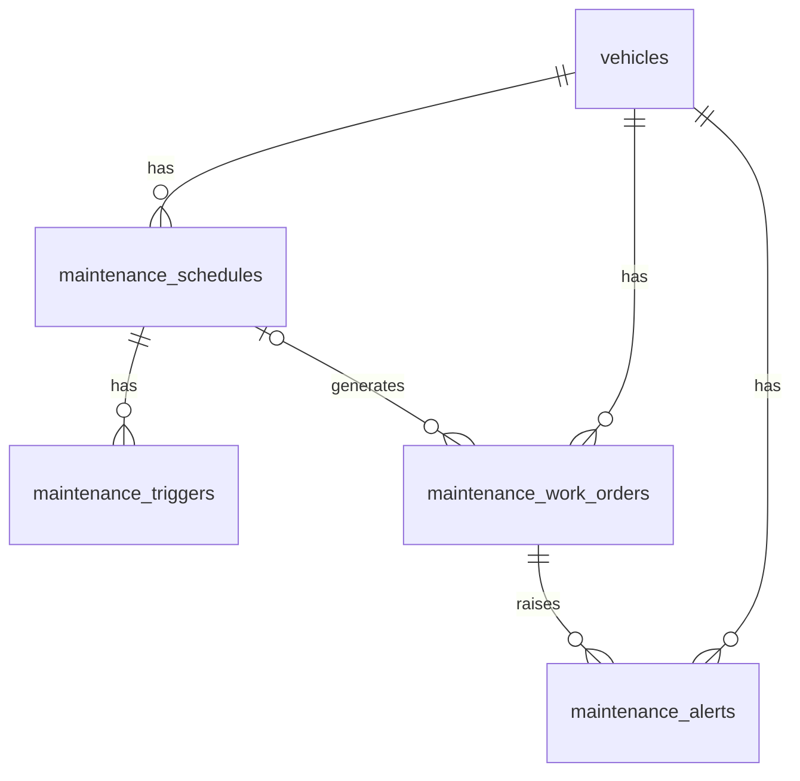

# Database Design - Maintenance and Service Scheduling

## Table of Contents
- [maintenance_schedules](#maintenance_schedules)
- [maintenance_triggers](#maintenance_triggers)
- [maintenance_work_orders](#maintenance_work_orders)
- [maintenance_alerts](#maintenance_alerts)
- [maintenance_priority_rules](#maintenance_priority_rules)

## Entity Relationship Diagram

## Tables

### maintenance_schedules

Defines the recurring/one-off maintenance plan for a vehicle, independent of the trigger source that will eventually fire it.

| Field | Data Type | Index | Constraint | Description |
| --- | --- | --- | --- | --- |
| id | UUID | Primary Key | NOT NULL | Unique identifier of the maintenance schedule |
| vehicle_id | UUID | Index | NOT NULL, Foreign Key -> vehicles.id | Vehicle the schedule applies to |
| schedule_name | TEXT | - | NOT NULL | Descriptive name of the maintenance plan (e.g., "Manufacturer 10k service") |
| service_type | TEXT | Index | NOT NULL, CHECK (service_type IN ('routine','inspection','recall','safety_defect','repair')) | Category of maintenance the schedule produces |
| source | TEXT | Index | NOT NULL, CHECK (source IN ('date','mileage','telematics','manufacturer_schedule')) | Source used to determine when the schedule is due |
| active | BOOL | Index | NOT NULL, DEFAULT true | Whether the schedule is currently enforced |
| created_at | TIMESTAMP WITH TIME ZONE | - | NOT NULL, DEFAULT now() | Record creation timestamp |
| updated_at | TIMESTAMP WITH TIME ZONE | - | NOT NULL, DEFAULT now() | Record last update timestamp |
| deleted_at | TIMESTAMP WITH TIME ZONE | - | NULL | Record soft-delete timestamp |
| created_by | TEXT | - | NOT NULL | Identifier of the user/system that created the record |
| updated_by | TEXT | - | NOT NULL | Identifier of the user/system that last updated the record |
| deleted | BOOL | - | NOT NULL, DEFAULT false | Soft-delete flag |

### maintenance_triggers

Holds the threshold configuration for a schedule, one row per active threshold type (a schedule can be evaluated against several thresholds at once, e.g., date and mileage).

| Field | Data Type | Index | Constraint | Description |
| --- | --- | --- | --- | --- |
| id | UUID | Primary Key | NOT NULL | Unique identifier of the trigger |
| maintenance_schedule_id | UUID | Index | NOT NULL, Foreign Key -> maintenance_schedules.id | Schedule this threshold belongs to |
| trigger_type | TEXT | Index | NOT NULL, CHECK (trigger_type IN ('date','mileage','telematics_signal','manufacturer_interval')) | Type of threshold evaluated |
| interval_value | DECIMAL(15,2) | - | NULL | Numeric interval used for the threshold (e.g., days, kilometers, engine hours) |
| interval_unit | TEXT | - | NULL, CHECK (interval_unit IN ('days','kilometers','miles','engine_hours')) | Unit associated with `interval_value` |
| last_evaluated_at | TIMESTAMP WITH TIME ZONE | - | NULL | Timestamp/mileage snapshot the threshold was last evaluated from |
| next_due_at | TIMESTAMP WITH TIME ZONE | Index | NULL | Computed next due date, when applicable |
| next_due_mileage | DECIMAL(15,2) | Index | NULL | Computed next due mileage, when applicable |
| created_at | TIMESTAMP WITH TIME ZONE | - | NOT NULL, DEFAULT now() | Record creation timestamp |
| updated_at | TIMESTAMP WITH TIME ZONE | - | NOT NULL, DEFAULT now() | Record last update timestamp |
| deleted_at | TIMESTAMP WITH TIME ZONE | - | NULL | Record soft-delete timestamp |
| created_by | TEXT | - | NOT NULL | Identifier of the user/system that created the record |
| updated_by | TEXT | - | NOT NULL | Identifier of the user/system that last updated the record |
| deleted | BOOL | - | NOT NULL, DEFAULT false | Soft-delete flag |

### maintenance_work_orders

Represents an actionable unit of maintenance work for a vehicle, either generated automatically from a schedule/trigger or created manually (e.g., for a recall or safety defect).

| Field | Data Type | Index | Constraint | Description |
| --- | --- | --- | --- | --- |
| id | UUID | Primary Key | NOT NULL | Unique identifier of the work order |
| vehicle_id | UUID | Index | NOT NULL, Foreign Key -> vehicles.id | Vehicle the work order applies to |
| maintenance_schedule_id | UUID | Index | NULL, Foreign Key -> maintenance_schedules.id | Originating schedule, null when the work order was created manually |
| service_type | TEXT | Index | NOT NULL, CHECK (service_type IN ('routine','inspection','recall','safety_defect','repair')) | Category of the work order |
| priority | TEXT | Index | NOT NULL, CHECK (priority IN ('routine','high','urgent')) | Priority level, urgent reserved for recalls/safety defects |
| status | TEXT | Index | NOT NULL, CHECK (status IN ('open','in_progress','completed','cancelled')), DEFAULT 'open' | Current lifecycle status of the work order |
| triggered_by | TEXT | Index | NOT NULL, CHECK (triggered_by IN ('date','mileage','telematics','manufacturer_schedule','recall','safety_defect','manual')) | What caused the work order to be generated |
| due_at | TIMESTAMP WITH TIME ZONE | Index | NULL | Date the work order is due |
| completed_at | TIMESTAMP WITH TIME ZONE | - | NULL | Timestamp the work order was marked completed |
| description | TEXT | - | NULL | Free-text description of the work required |
| created_at | TIMESTAMP WITH TIME ZONE | - | NOT NULL, DEFAULT now() | Record creation timestamp |
| updated_at | TIMESTAMP WITH TIME ZONE | - | NOT NULL, DEFAULT now() | Record last update timestamp |
| deleted_at | TIMESTAMP WITH TIME ZONE | - | NULL | Record soft-delete timestamp |
| created_by | TEXT | - | NOT NULL | Identifier of the user/system that created the record |
| updated_by | TEXT | - | NOT NULL | Identifier of the user/system that last updated the record |
| deleted | BOOL | - | NOT NULL, DEFAULT false | Soft-delete flag |

### maintenance_alerts

Notification records raised for overdue service, expiring documents, or recalls, so staff can be alerted through the dashboard/notification channel.

| Field | Data Type | Index | Constraint | Description |
| --- | --- | --- | --- | --- |
| id | UUID | Primary Key | NOT NULL | Unique identifier of the alert |
| vehicle_id | UUID | Index | NOT NULL, Foreign Key -> vehicles.id | Vehicle the alert refers to |
| maintenance_work_order_id | UUID | Index | NULL, Foreign Key -> maintenance_work_orders.id | Related work order, when applicable |
| alert_type | TEXT | Index | NOT NULL, CHECK (alert_type IN ('overdue_service','expiring_document','recall')) | Reason the alert was raised |
| severity | TEXT | Index | NOT NULL, CHECK (severity IN ('info','warning','critical')) | Severity level of the alert |
| acknowledged_at | TIMESTAMP WITH TIME ZONE | - | NULL | Timestamp a staff member acknowledged the alert |
| acknowledged_by | TEXT | - | NULL | Identifier of the staff member who acknowledged the alert |
| created_at | TIMESTAMP WITH TIME ZONE | - | NOT NULL, DEFAULT now() | Record creation timestamp |
| updated_at | TIMESTAMP WITH TIME ZONE | - | NOT NULL, DEFAULT now() | Record last update timestamp |
| deleted_at | TIMESTAMP WITH TIME ZONE | - | NULL | Record soft-delete timestamp |
| created_by | TEXT | - | NOT NULL | Identifier of the user/system that created the record |
| updated_by | TEXT | - | NOT NULL | Identifier of the user/system that last updated the record |
| deleted | BOOL | - | NOT NULL, DEFAULT false | Soft-delete flag |

### maintenance_priority_rules

Configuration table mapping a service type to its default priority, so urgent repairs, recalls, and safety defects can be ranked ahead of routine maintenance without hardcoding the logic.

| Field | Data Type | Index | Constraint | Description |
| --- | --- | --- | --- | --- |
| id | UUID | Primary Key | NOT NULL | Unique identifier of the priority rule |
| service_type | TEXT | Index | NOT NULL, UNIQUE, CHECK (service_type IN ('routine','inspection','recall','safety_defect','repair')) | Service type the rule applies to |
| default_priority | TEXT | - | NOT NULL, CHECK (default_priority IN ('routine','high','urgent')) | Priority automatically assigned to work orders of this service type |
| created_at | TIMESTAMP WITH TIME ZONE | - | NOT NULL, DEFAULT now() | Record creation timestamp |
| updated_at | TIMESTAMP WITH TIME ZONE | - | NOT NULL, DEFAULT now() | Record last update timestamp |
| deleted_at | TIMESTAMP WITH TIME ZONE | - | NULL | Record soft-delete timestamp |
| created_by | TEXT | - | NOT NULL | Identifier of the user/system that created the record |
| updated_by | TEXT | - | NOT NULL | Identifier of the user/system that last updated the record |
| deleted | BOOL | - | NOT NULL, DEFAULT false | Soft-delete flag |
