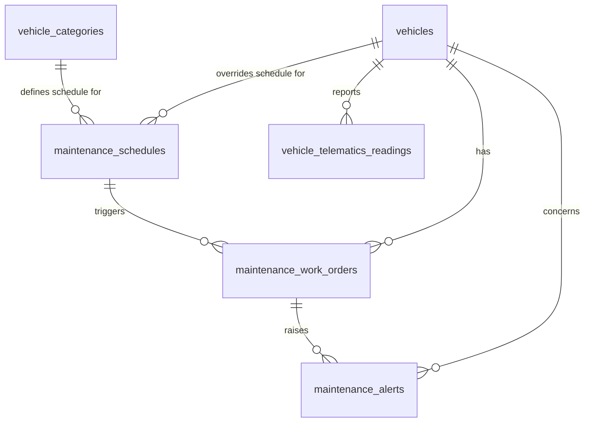

# Database Design - Maintenance and Service Scheduling

## Table of Contents
- [maintenance_schedules](#maintenance_schedules)
- [vehicle_telematics_readings](#vehicle_telematics_readings)
- [maintenance_work_orders](#maintenance_work_orders)
- [maintenance_alerts](#maintenance_alerts)

## Entity Relationship Diagram

## Tables

This document only introduces new tables. It does not modify the `vehicles` table; the canonical `vehicles` table definition is the one in [Database Design - Vehicle Status and Availability](./database-design-vehicle-status-availability.md#vehicles), which this feature references by `vehicle_id` foreign keys only. The `vehicle_categories` table referenced below is the one defined in [Database Design - Vehicle Onboarding](./database-design-vehicle-onboarding.md#vehicle_categories).

### maintenance_schedules

Configurable maintenance-trigger rules. A rule can apply to an entire vehicle category (`vehicle_category_id` set, `vehicle_id` null) or override the category rule for a single vehicle (`vehicle_id` set).

| Field | Data Type | Index | Constraint | Description |
| --- | --- | --- | --- | --- |
| id | UUID | Primary Key | NOT NULL, UNIQUE | Unique identifier of the maintenance schedule rule |
| vehicle_category_id | UUID | Index | NULL, Foreign Key -> vehicle_categories.id | Category the rule applies to; null when the rule is a vehicle-specific override |
| vehicle_id | UUID | Index | NULL, Foreign Key -> vehicles.id | Vehicle the rule applies to; null when the rule is category-wide |
| trigger_type | TEXT | Index | NOT NULL, CHECK (trigger_type IN ('date_interval','mileage_interval','manufacturer_schedule','telematics_condition')) | Source used to determine when maintenance is due |
| interval_days | INTEGER | - | NULL, `> 0` | Number of days between services; required when trigger_type = 'date_interval' |
| interval_mileage | DECIMAL | - | NULL, `> 0` | Mileage between services; required when trigger_type = 'mileage_interval' |
| manufacturer_reference | TEXT | - | NULL | Manufacturer-published service plan identifier/code; required when trigger_type = 'manufacturer_schedule' |
| telematics_condition | TEXT | - | NULL | Description/code of the telematics-reported condition that triggers service; required when trigger_type = 'telematics_condition' |
| active | BOOL | - | NOT NULL, DEFAULT true | Whether the rule is currently in effect |
| created_at | TIMESTAMP WITH TIME ZONE | - | NOT NULL, DEFAULT now() | Record creation timestamp |
| updated_at | TIMESTAMP WITH TIME ZONE | - | NOT NULL, DEFAULT now() | Record last update timestamp |
| deleted_at | TIMESTAMP WITH TIME ZONE | - | NULL | Record soft-delete timestamp |
| created_by | TEXT | - | NOT NULL | Identifier of the user/system that created the record |
| updated_by | TEXT | - | NOT NULL | Identifier of the user/system that last updated the record |
| deleted | BOOL | - | NOT NULL, DEFAULT false | Soft-delete flag |

### vehicle_telematics_readings

Raw odometer/date/condition readings reported by the telematics source, used to evaluate whether a `maintenance_schedules` rule has been met.

| Field | Data Type | Index | Constraint | Description |
| --- | --- | --- | --- | --- |
| id | UUID | Primary Key | NOT NULL, UNIQUE | Unique identifier of the telematics reading |
| vehicle_id | UUID | Index | NOT NULL, Foreign Key -> vehicles.id | Vehicle the reading belongs to |
| reading_type | TEXT | Index | NOT NULL, CHECK (reading_type IN ('mileage','diagnostic_code','condition_alert')) | Type of telematics data reported |
| mileage_value | DECIMAL | - | NULL, `>= 0` | Odometer value reported; populated when reading_type = 'mileage' |
| condition_code | TEXT | - | NULL | Diagnostic/condition code reported; populated when reading_type is 'diagnostic_code' or 'condition_alert' |
| reported_at | TIMESTAMP WITH TIME ZONE | Index | NOT NULL | Timestamp the telematics source reported the reading |
| created_at | TIMESTAMP WITH TIME ZONE | - | NOT NULL, DEFAULT now() | Record creation timestamp |
| updated_at | TIMESTAMP WITH TIME ZONE | - | NOT NULL, DEFAULT now() | Record last update timestamp |
| deleted_at | TIMESTAMP WITH TIME ZONE | - | NULL | Record soft-delete timestamp |
| created_by | TEXT | - | NOT NULL | Identifier of the user/system that created the record |
| updated_by | TEXT | - | NOT NULL | Identifier of the user/system that last updated the record |
| deleted | BOOL | - | NOT NULL, DEFAULT false | Soft-delete flag |

### maintenance_work_orders

A work order generated when a maintenance trigger fires, or when a recall/safety defect is logged. Tracks priority and lifecycle through to completion.

| Field | Data Type | Index | Constraint | Description |
| --- | --- | --- | --- | --- |
| id | UUID | Primary Key | NOT NULL, UNIQUE | Unique identifier of the work order |
| vehicle_id | UUID | Index | NOT NULL, Foreign Key -> vehicles.id | Vehicle the work order applies to |
| maintenance_schedule_id | UUID | Index | NULL, Foreign Key -> maintenance_schedules.id | Rule that generated this work order; null for recall/safety-defect work orders logged directly |
| trigger_source | TEXT | Index | NOT NULL, CHECK (trigger_source IN ('date_interval','mileage_interval','manufacturer_schedule','telematics_condition','recall','safety_defect')) | What caused this work order to be created |
| priority | TEXT | Index | NOT NULL, CHECK (priority IN ('routine','urgent')) | Priority of the work order; recalls and safety defects must be 'urgent' |
| status | TEXT | Index | NOT NULL, DEFAULT 'open', CHECK (status IN ('open','scheduled','in_progress','completed','cancelled')) | Current lifecycle state of the work order |
| due_at | TIMESTAMP WITH TIME ZONE | Index | NULL | Date/time by which the service must be performed, when known |
| scheduled_at | TIMESTAMP WITH TIME ZONE | - | NULL | Date/time the service appointment is booked for |
| completed_at | TIMESTAMP WITH TIME ZONE | - | NULL | Date/time the service was completed |
| description | TEXT | - | NULL | Free-text description of the required work (e.g., recall notice text) |
| created_at | TIMESTAMP WITH TIME ZONE | - | NOT NULL, DEFAULT now() | Record creation timestamp |
| updated_at | TIMESTAMP WITH TIME ZONE | - | NOT NULL, DEFAULT now() | Record last update timestamp |
| deleted_at | TIMESTAMP WITH TIME ZONE | - | NULL | Record soft-delete timestamp |
| created_by | TEXT | - | NOT NULL | Identifier of the user/system that created the record |
| updated_by | TEXT | - | NOT NULL | Identifier of the user/system that last updated the record |
| deleted | BOOL | - | NOT NULL, DEFAULT false | Soft-delete flag |

### maintenance_alerts

Alerts raised for overdue service, expiring compliance documents, and recalls, so Service staff and Operations managers can act on them.

| Field | Data Type | Index | Constraint | Description |
| --- | --- | --- | --- | --- |
| id | UUID | Primary Key | NOT NULL, UNIQUE | Unique identifier of the alert |
| vehicle_id | UUID | Index | NOT NULL, Foreign Key -> vehicles.id | Vehicle the alert concerns |
| maintenance_work_order_id | UUID | Index | NULL, Foreign Key -> maintenance_work_orders.id | Related work order, when the alert concerns overdue service or a recall/safety defect |
| compliance_document_id | UUID | Index | NULL, Foreign Key -> vehicle_compliance_documents.id | Related compliance document, when the alert concerns an expiring registration/insurance/inspection document (see [Database Design - Vehicle Status and Availability](./database-design-vehicle-status-availability.md#vehicle_compliance_documents)) |
| alert_type | TEXT | Index | NOT NULL, CHECK (alert_type IN ('overdue_service','expiring_document','recall','safety_defect')) | Reason the alert was raised |
| severity | TEXT | Index | NOT NULL, CHECK (severity IN ('normal','urgent')) | Severity of the alert; recalls and safety defects must be 'urgent' |
| status | TEXT | Index | NOT NULL, DEFAULT 'open', CHECK (status IN ('open','acknowledged','resolved')) | Current lifecycle state of the alert |
| raised_at | TIMESTAMP WITH TIME ZONE | Index | NOT NULL | Date/time the alert was raised |
| acknowledged_at | TIMESTAMP WITH TIME ZONE | - | NULL | Date/time the alert was acknowledged by staff |
| resolved_at | TIMESTAMP WITH TIME ZONE | - | NULL | Date/time the alert was resolved |
| created_at | TIMESTAMP WITH TIME ZONE | - | NOT NULL, DEFAULT now() | Record creation timestamp |
| updated_at | TIMESTAMP WITH TIME ZONE | - | NOT NULL, DEFAULT now() | Record last update timestamp |
| deleted_at | TIMESTAMP WITH TIME ZONE | - | NULL | Record soft-delete timestamp |
| created_by | TEXT | - | NOT NULL | Identifier of the user/system that created the record |
| updated_by | TEXT | - | NOT NULL | Identifier of the user/system that last updated the record |
| deleted | BOOL | - | NOT NULL, DEFAULT false | Soft-delete flag |
