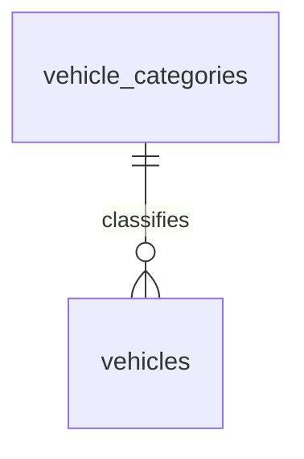

# Database Design - Vehicle Onboarding

## Table of Contents
- [vehicle_categories](#vehicle_categories)
- [vehicles](#vehicles)

## Entity Relationship Diagram

## Tables

### vehicle_categories

| Field | Data Type | Index | Constraints | Description |
| --- | --- | --- | --- | --- |
| id | UUID | Primary Key | NOT NULL, UNIQUE | Unique identifier of the vehicle category/class. |
| name | TEXT | Index | NOT NULL, UNIQUE | Name of the vehicle category/class (e.g., Economy, SUV, Luxury). |
| description | TEXT | | | Description of the vehicle category/class. |
| active | BOOL | | NOT NULL, DEFAULT `true` | Whether the category is currently active and selectable for onboarding. |
| created_at | TIMESTAMP WITH TIME ZONE | | NOT NULL | Timestamp when the record was created. |
| updated_at | TIMESTAMP WITH TIME ZONE | | NOT NULL | Timestamp when the record was last updated. |
| deleted_at | TIMESTAMP WITH TIME ZONE | | | Timestamp when the record was soft-deleted. |
| created_by | TEXT | | NOT NULL | Identifier of the user who created the record. |
| updated_by | TEXT | | NOT NULL | Identifier of the user who last updated the record. |
| deleted | BOOL | | NOT NULL, DEFAULT `false` | Soft-delete flag. |

### vehicles

This is the single, canonical definition of the `vehicles` table, consolidating the fields previously duplicated across the Vehicle Onboarding, Vehicle-Type Booking, and Vehicle Status & Availability TRDs. Other TRDs that reference vehicle data (booking, status/availability, etc.) must reuse this definition rather than redeclaring the table.

| Field | Data Type | Index | Constraints | Description |
| --- | --- | --- | --- | --- |
| id | UUID | Primary Key | NOT NULL, UNIQUE | Unique identifier of the vehicle. |
| vin | TEXT | Unique Index | NOT NULL, UNIQUE | Vehicle Identification Number. |
| plate_number | TEXT | Unique Index | NOT NULL, UNIQUE | Vehicle license plate number. |
| make | TEXT | | NOT NULL | Vehicle manufacturer/make. |
| model | TEXT | | NOT NULL | Vehicle model. |
| year | INTEGER | | NOT NULL | Vehicle model year. |
| category_id | UUID | Foreign Key (vehicle_categories.id) | NOT NULL | Category/class the vehicle belongs to. |
| mileage | DECIMAL | | NOT NULL, `>= 0` | Current recorded mileage of the vehicle. |
| fuel_level | DECIMAL | | NOT NULL, `BETWEEN 0 AND 100` | Current fuel level as a percentage. |
| location | TEXT | | NOT NULL | Current location identifier or description of the vehicle. |
| condition_notes | TEXT | | | Free-text notes describing the vehicle's condition. |
| status | TEXT | Index | NOT NULL, DEFAULT `'available'`, CHECK (status IN ('available','reserved','rented','cleaning','maintenance','damaged','retired')) | Current lifecycle status of the vehicle, owned/updated by the Vehicle Status & Availability feature. |
| status_since | TIMESTAMP WITH TIME ZONE | | NOT NULL | Timestamp of when the current `status` became effective. |
| created_at | TIMESTAMP WITH TIME ZONE | | NOT NULL | Timestamp when the record was created. |
| updated_at | TIMESTAMP WITH TIME ZONE | | NOT NULL | Timestamp when the record was last updated. |
| deleted_at | TIMESTAMP WITH TIME ZONE | | | Timestamp when the record was soft-deleted. |
| created_by | TEXT | | NOT NULL | Identifier of the user who created the record. |
| updated_by | TEXT | | NOT NULL | Identifier of the user who last updated the record. |
| deleted | BOOL | | NOT NULL, DEFAULT `false` | Soft-delete flag. |
