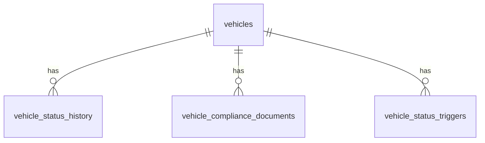

# Database Design - Vehicle Status and Availability

## Table of Contents
- [vehicles](#vehicles)
- [vehicle_status_history](#vehicle_status_history)
- [vehicle_compliance_documents](#vehicle_compliance_documents)
- [vehicle_status_triggers](#vehicle_status_triggers)

## Entity Relationship Diagram

## Tables

### vehicles

Only the columns relevant to status/availability tracking are listed here. Vehicle identity/master-data columns (VIN, make/model, mileage, etc.) are defined by the Vehicle Master Data feature and are out of scope for this document.

| Field | Data Type | Index | Constraint | Description |
| --- | --- | --- | --- | --- |
| id | UUID | Primary Key | NOT NULL | Unique identifier of the vehicle |
| category_id | UUID | Index | NOT NULL, Foreign Key -> vehicle_categories.id | Category/class the vehicle belongs to (referenced from the booking feature) |
| current_status | TEXT | Index | NOT NULL, CHECK (current_status IN ('available','reserved','rented','cleaning','maintenance','damaged','retired')) | Current lifecycle status of the vehicle |
| current_status_since | TIMESTAMP WITH TIME ZONE | - | NOT NULL | Timestamp of when the current status became effective |
| created_at | TIMESTAMP WITH TIME ZONE | - | NOT NULL, DEFAULT now() | Record creation timestamp |
| updated_at | TIMESTAMP WITH TIME ZONE | - | NOT NULL, DEFAULT now() | Record last update timestamp |
| deleted_at | TIMESTAMP WITH TIME ZONE | - | NULL | Record soft-delete timestamp |
| created_by | TEXT | - | NOT NULL | Identifier of the user/system that created the record |
| updated_by | TEXT | - | NOT NULL | Identifier of the user/system that last updated the record |
| deleted | BOOL | - | NOT NULL, DEFAULT false | Soft-delete flag |

### vehicle_status_history

Append-only audit trail of every status transition for a vehicle.

| Field | Data Type | Index | Constraint | Description |
| --- | --- | --- | --- | --- |
| id | UUID | Primary Key | NOT NULL | Unique identifier of the history entry |
| vehicle_id | UUID | Index | NOT NULL, Foreign Key -> vehicles.id | Vehicle the transition belongs to |
| previous_status | TEXT | - | NULL, CHECK (previous_status IN ('available','reserved','rented','cleaning','maintenance','damaged','retired')) | Status before the transition (null for the first entry) |
| new_status | TEXT | Index | NOT NULL, CHECK (new_status IN ('available','reserved','rented','cleaning','maintenance','damaged','retired')) | Status after the transition |
| trigger_event | TEXT | Index | NOT NULL | Event that caused the transition (e.g., booking_confirmed, handover_completed, return_completed, maintenance_scheduled, damage_reported, compliance_expired, manual_override) |
| reason | TEXT | - | NULL | Free-text or coded explanation of the transition, required for manual overrides |
| effective_at | TIMESTAMP WITH TIME ZONE | Index | NOT NULL | Timestamp the transition took/takes effect |
| created_at | TIMESTAMP WITH TIME ZONE | - | NOT NULL, DEFAULT now() | Record creation timestamp |
| updated_at | TIMESTAMP WITH TIME ZONE | - | NOT NULL, DEFAULT now() | Record last update timestamp |
| deleted_at | TIMESTAMP WITH TIME ZONE | - | NULL | Record soft-delete timestamp |
| created_by | TEXT | - | NOT NULL | Identifier of the user/system that created the record |
| updated_by | TEXT | - | NOT NULL | Identifier of the user/system that last updated the record |
| deleted | BOOL | - | NOT NULL, DEFAULT false | Soft-delete flag |

### vehicle_compliance_documents

Tracks registration, insurance, inspection, and recall records whose expiry or open state can force a vehicle out of the available pool.

| Field | Data Type | Index | Constraint | Description |
| --- | --- | --- | --- | --- |
| id | UUID | Primary Key | NOT NULL | Unique identifier of the compliance document |
| vehicle_id | UUID | Index | NOT NULL, Foreign Key -> vehicles.id | Vehicle the document applies to |
| document_type | TEXT | Index | NOT NULL, CHECK (document_type IN ('registration','insurance','inspection','recall')) | Type of compliance document |
| status | TEXT | Index | NOT NULL, CHECK (status IN ('valid','expired','open','resolved')) | Current status of the document/recall |
| expires_at | TIMESTAMP WITH TIME ZONE | Index | NULL | Expiry date, applicable to registration/insurance/inspection |
| resolved_at | TIMESTAMP WITH TIME ZONE | - | NULL | Timestamp the recall/expiry condition was resolved |
| reference_number | TEXT | - | NULL | External reference (policy number, recall number, etc.) |
| created_at | TIMESTAMP WITH TIME ZONE | - | NOT NULL, DEFAULT now() | Record creation timestamp |
| updated_at | TIMESTAMP WITH TIME ZONE | - | NOT NULL, DEFAULT now() | Record last update timestamp |
| deleted_at | TIMESTAMP WITH TIME ZONE | - | NULL | Record soft-delete timestamp |
| created_by | TEXT | - | NOT NULL | Identifier of the user/system that created the record |
| updated_by | TEXT | - | NOT NULL | Identifier of the user/system that last updated the record |
| deleted | BOOL | - | NOT NULL, DEFAULT false | Soft-delete flag |

### vehicle_status_triggers

Configuration table mapping external/internal event types to the resulting automatic status transition. Allows the transition rules to be adjusted without code changes.

| Field | Data Type | Index | Constraint | Description |
| --- | --- | --- | --- | --- |
| id | UUID | Primary Key | NOT NULL | Unique identifier of the trigger rule |
| event_type | TEXT | Index | NOT NULL, UNIQUE | Event type that activates the rule (e.g., booking_confirmed) |
| resulting_status | TEXT | - | NOT NULL, CHECK (resulting_status IN ('available','reserved','rented','cleaning','maintenance','damaged','retired')) | Status applied when the event fires |
| requires_reason | BOOL | - | NOT NULL, DEFAULT false | Whether a reason must be supplied when this rule fires |
| created_at | TIMESTAMP WITH TIME ZONE | - | NOT NULL, DEFAULT now() | Record creation timestamp |
| updated_at | TIMESTAMP WITH TIME ZONE | - | NOT NULL, DEFAULT now() | Record last update timestamp |
| deleted_at | TIMESTAMP WITH TIME ZONE | - | NULL | Record soft-delete timestamp |
| created_by | TEXT | - | NOT NULL | Identifier of the user/system that created the record |
| updated_by | TEXT | - | NOT NULL | Identifier of the user/system that last updated the record |
| deleted | BOOL | - | NOT NULL, DEFAULT false | Soft-delete flag |
