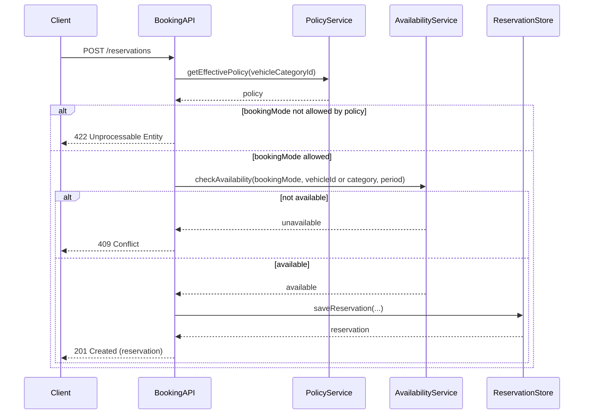

# TRD - Car Management Vehicle Type Booking

## Document Information
- Feature Name: Car Management - Vehicle Type Booking
- Author: copilot
- Date:
- Version:

## Table of Contents
- [Background](#background)
- [In Scope](#in-scope)
- [Constraints](#constraints)
- [Technical Requirements](#technical-requirements)
- [Security Requirement](#security-requirement)
- [Non-Functional Requirements](#non-functional-requirements)
- [AI usage disclaimer](#ai-usage-disclaimer)

## Background
This TRD implements the [Support Vehicle-Level and Category-Level Booking](https://github.com/mshahkap33/ai-sdlc/blob/main/docs/prd/prd-car-management.md#support-vehicle-level-and-category-level-booking) functional requirement defined in the PRD - Car Management document. That requirement states that a customer must be able to reserve either a specific vehicle (exact VIN/plate) or a vehicle category/class, with the allowed reservation mode configurable per booking policy, so that booking flexibility matches business policy and customer expectations.

## In Scope
- Defining the data model needed to represent vehicle categories, individual vehicles, per-category booking policies, and reservations that reference either a specific vehicle or only a category.
- Defining the REST API to create, retrieve, and cancel a reservation that supports both vehicle-level and category-level booking modes.
- Defining the REST API to configure and retrieve the booking policy (allowed reservation mode) for a vehicle category.
- Defining the validation and assignment logic used to determine whether a booking request is honored as vehicle-level or category-level, based on the active policy for the requested category.
- Defining the logic used to select and hold an exact vehicle for a category-level reservation at fulfillment time (i.e., when a specific vehicle must ultimately be assigned to satisfy the rental).

## Constraints
- Automatic status transitions of a vehicle (e.g., available → reserved → rented) as a whole, and the general vehicle status state machine, are governed by the "Manage Vehicle Status and Availability" requirement and are out of scope for this document; this TRD only describes how a reservation determines and records the vehicle (or category) it is held against.
- Conflict/double-booking validation across overlapping time periods is governed by the "Prevent Double-Booking" requirement and is out of scope for this document; this TRD assumes that capability is invoked during reservation confirmation and vehicle assignment but does not redefine it.
- Maintenance of vehicle master data (VIN, plate, make/model, mileage, fuel level, location, condition) is governed by the "Maintain Vehicle Master Data" requirement and is out of scope for this document.
- Pricing, payment, and billing calculations associated with a reservation are out of scope for this document.
- Customer-facing UI/UX flows for browsing and selecting a vehicle or category are out of scope; only the backend contract and validations are described.

## Technical Requirements

### Database Design
The tables required for vehicle-level and category-level booking (vehicle categories, vehicles, booking policies, reservations, and reservation-vehicle assignments) are defined in [database-design-car-management-vehicle-type-booking.md](./database-design-car-management-vehicle-type-booking.md).

### Backend
- The booking capability must be exposed as a REST API. No requirement in this scope needs a non-REST protocol.
- All endpoints must accept and return JSON payloads and use standard HTTP status codes (`200`, `201`, `400`, `404`, `409`, `422`) to indicate outcome.
- Common validation:
  - `vehicleCategoryId` must reference an existing, non-deleted vehicle category.
  - `bookingMode` must be one of `VEHICLE_LEVEL` or `CATEGORY_LEVEL`.
  - When `bookingMode` is `VEHICLE_LEVEL`, `vehicleId` is required and must reference an existing vehicle that belongs to `vehicleCategoryId`.
  - When `bookingMode` is `CATEGORY_LEVEL`, `vehicleId` must not be supplied.
  - `startDateTime` and `endDateTime` must be valid ISO-8601 date-times, and `endDateTime` must be strictly after `startDateTime`.
  - The requested `bookingMode` must be permitted by the currently effective booking policy for the `vehicleCategoryId` (i.e., the policy's `booking_mode` must equal the requested mode, or be `both`).

#### REST API: Create Reservation
- **Method / URL:** `POST /api/v1/reservations`
- **Request Body:**
  ```json
  {
    "vehicleCategoryId": "string (UUID)",
    "bookingMode": "VEHICLE_LEVEL | CATEGORY_LEVEL",
    "vehicleId": "string (UUID, required only when bookingMode = VEHICLE_LEVEL)",
    "startDateTime": "string (ISO-8601 date-time)",
    "endDateTime": "string (ISO-8601 date-time)"
  }
  ```
- **Response Body (201):**
  ```json
  {
    "reservationId": "string (UUID)",
    "vehicleCategoryId": "string (UUID)",
    "bookingMode": "VEHICLE_LEVEL | CATEGORY_LEVEL",
    "vehicleId": "string (UUID, present only when bookingMode = VEHICLE_LEVEL)",
    "status": "PENDING | CONFIRMED",
    "startDateTime": "string (ISO-8601 date-time)",
    "endDateTime": "string (ISO-8601 date-time)"
  }
  ```
- **Error Responses:** `400` (malformed payload), `404` (category or vehicle not found), `422` (booking mode not permitted by policy, or vehicle does not belong to the requested category), `409` (vehicle unavailable for the requested period, delegated to the double-booking check).

#### REST API: Get Booking Policy
- **Method / URL:** `GET /api/v1/vehicle-categories/{categoryId}/booking-policy`
- **Path Parameter:** `categoryId` (UUID, required)
- **Response Body (200):**
  ```json
  {
    "vehicleCategoryId": "string (UUID)",
    "bookingMode": "VEHICLE_LEVEL | CATEGORY_LEVEL | BOTH",
    "effectiveFrom": "string (ISO-8601 date-time)",
    "effectiveTo": "string (ISO-8601 date-time, nullable)"
  }
  ```
- **Error Responses:** `404` (category not found or no effective policy).

#### REST API: Configure Booking Policy
- **Method / URL:** `PUT /api/v1/vehicle-categories/{categoryId}/booking-policy`
- **Path Parameter:** `categoryId` (UUID, required)
- **Request Body:**
  ```json
  {
    "bookingMode": "VEHICLE_LEVEL | CATEGORY_LEVEL | BOTH",
    "effectiveFrom": "string (ISO-8601 date-time)",
    "effectiveTo": "string (ISO-8601 date-time, optional)"
  }
  ```
- **Response Body (200):** Same shape as the Get Booking Policy response.
- **Error Responses:** `400` (malformed payload), `404` (category not found).

#### Reservation Creation Algorithm
```
function createReservation(request):
    category = findVehicleCategory(request.vehicleCategoryId)
    if category is null or category.deleted:
        return error(404, "Vehicle category not found")

    policy = findEffectiveBookingPolicy(category.id, now())
    if policy is null:
        return error(422, "No active booking policy for category")

    if request.bookingMode not in policy.allowedModes:
        return error(422, "Booking mode not permitted by policy")

    if request.bookingMode == VEHICLE_LEVEL:
        vehicle = findVehicle(request.vehicleId)
        if vehicle is null or vehicle.vehicleCategoryId != category.id:
            return error(404, "Vehicle not found in requested category")
        if not isVehicleAvailable(vehicle, request.startDateTime, request.endDateTime):
            return error(409, "Vehicle unavailable for requested period")
        reservation = saveReservation(category, VEHICLE_LEVEL, vehicle, request.startDateTime, request.endDateTime, status = CONFIRMED)
        saveReservationVehicleAssignment(reservation, vehicle, assignmentType = CUSTOMER_SELECTED)
    else:
        if not hasAvailableVehicleInCategory(category, request.startDateTime, request.endDateTime):
            return error(409, "No vehicle available in category for requested period")
        reservation = saveReservation(category, CATEGORY_LEVEL, vehicle = null, request.startDateTime, request.endDateTime, status = CONFIRMED)
        # exact vehicle assignment for a category-level reservation is deferred to fulfillment time

    return success(201, reservation)
```

#### Reservation Creation Sequence


## Security Requirement
- All reservation and booking-policy endpoints must require an authenticated request bearing a JWT access token signed with the `RS256` algorithm.
- The JWT payload must include, at minimum: `sub` (staff or customer identifier), `role` (e.g., `customer`, `delivery_pickup_staff`, `operations_manager`), `iat`, and `exp` claims. Tokens must be validated for signature, expiry, and issuer before any request is processed.
- Configuring or updating a booking policy (`PUT /api/v1/vehicle-categories/{categoryId}/booking-policy`) must be restricted to roles authorized to manage booking policy configuration (e.g., `operations_manager`); requests from other roles must be rejected with `403 Forbidden`.
- All requests and responses must be transmitted over HTTPS/TLS.
- Reservation identifiers must be non-sequential (UUID) to prevent enumeration of other customers' reservations.

## Non-Functional Requirements


## AI usage disclaimer
*This document was generated with the assistance of artificial intelligence and should be reviewed by a human for accuracy and completeness.*
