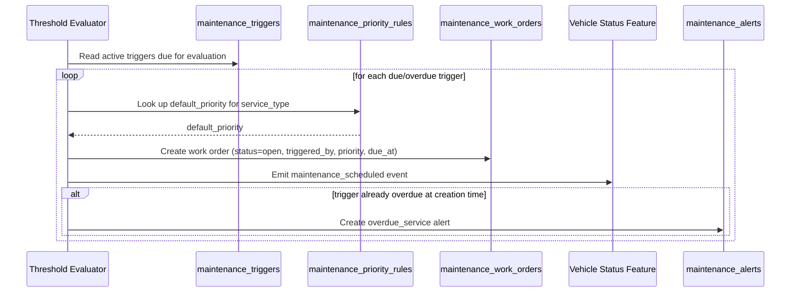

# TRD - Schedule and Track Maintenance

## Document Information
- Feature Name: Schedule and Track Maintenance
- Author: copilot
- Date:
- Version:

## Table of Contents
- [Background](#background)
- [In Scope](#in-scope)
- [Constraints](#constraints)
- [Technical Requirements](#technical-requirements)
- [Security Requirement](#security-requirement)
- [Non-Functional Requirements](#non-functional-requirements)
- [AI usage disclaimer](#ai-usage-disclaimer)

## Background
This TRD implements the "Schedule and Track Maintenance" requirement from the [PRD - Car Management](../prd/prd-car-management.md#schedule-and-track-maintenance). The requirement states that the system must support triggering maintenance schedules from multiple sources (date, mileage, telematics, manufacturer schedule), prioritize urgent repairs, recalls, and safety defects, and generate alerts for overdue service, expiring documents, and recalls, so that Service staff can keep vehicles safe and compliant.

## In Scope
- Definition of maintenance schedules per vehicle and the thresholds (date, mileage, telematics signal, manufacturer interval) that determine when a schedule is due.
- Automatic generation of maintenance work orders when a schedule threshold is met.
- Manual creation of work orders for recalls and safety defects reported outside of a scheduled threshold.
- Priority assignment for work orders, ensuring urgent repairs, recalls, and safety defects are ranked above routine maintenance.
- Generation of alerts for overdue service, expiring compliance documents, and open recalls, and the ability for staff to acknowledge them.
- REST APIs to manage maintenance schedules, query/manage work orders, and query/acknowledge alerts.

## Constraints
- Vehicle master data (VIN, plate, make/model, mileage, location) is out of scope; this TRD only reads the vehicle's current mileage/telematics data required to evaluate thresholds, as defined by the Vehicle Master Data feature.
- The vehicle status state machine (transitioning a vehicle to/out of the `maintenance` status when a work order is opened/closed) is out of scope; this TRD only emits a `maintenance_scheduled` or `maintenance_completed` event for the Manage Vehicle Status and Availability feature to consume, as described in [TRD - Manage Vehicle Status and Availability](./trd-vehicle-status-availability.md).
- Registration/insurance/inspection document expiry tracking itself is out of scope; this TRD only consumes expiry information from `vehicle_compliance_documents` (owned by the Vehicle Status and Availability feature) to raise `expiring_document` and `recall` alerts.
- Telematics hardware/device integration (how signals are collected and transmitted) is out of scope; this TRD only consumes a normalized telematics signal/reading as input to threshold evaluation.
- Assignment of technicians, parts inventory, cost tracking, and third-party service platform integration are out of scope.
- Notification delivery channels (e.g., email, SMS, push) are out of scope; this TRD only defines when an alert record is created and how it is queried/acknowledged.

## Technical Requirements

### Database Design
See [Database Design - Maintenance and Service Scheduling](./database-design-maintenance-scheduling.md) for the full list of tables:
- `maintenance_schedules`
- `maintenance_triggers`
- `maintenance_work_orders`
- `maintenance_alerts`
- `maintenance_priority_rules`

### Backend

#### Threshold Evaluation and Work Order Generation
A periodic evaluation process (and an event-driven check on relevant updates, e.g., mileage/telematics updates) determines whether a schedule's threshold has been met.



- Recalls and safety defects reported outside of a scheduled threshold must be created directly as a `maintenance_work_order` with `triggered_by = 'recall'` or `triggered_by = 'safety_defect'`, and must always resolve to `priority = 'urgent'` regardless of the `maintenance_priority_rules` default.
- When a work order transitions to `completed`, the corresponding trigger's `last_evaluated_at`/mileage baseline must be updated and its `next_due_at`/`next_due_mileage` recomputed from the schedule's interval configuration, and a `maintenance_completed` event must be emitted to the Vehicle Status feature.
- A compliance scan (owned by the Vehicle Status and Availability feature) that detects an expired document or open recall must result in a corresponding `maintenance_alerts` entry being created here with `alert_type = 'expiring_document'` or `alert_type = 'recall'`.

#### REST API Specification

**1. Create a maintenance schedule**
- Method: `POST`
- URL: `/api/v1/vehicles/{vehicleId}/maintenance-schedules`
- Path parameter: `vehicleId` (UUID, required)
- Request body:
  ```json
  {
    "scheduleName": "string, required",
    "serviceType": "routine | inspection | recall | safety_defect | repair",
    "source": "date | mileage | telematics | manufacturer_schedule",
    "triggers": [
      {
        "triggerType": "date | mileage | telematics_signal | manufacturer_interval",
        "intervalValue": "decimal, required unless the trigger is manufacturer-defined",
        "intervalUnit": "days | kilometers | miles | engine_hours"
      }
    ]
  }
  ```
- Response body: the created schedule with its generated `id` and computed `nextDueAt`/`nextDueMileage` per trigger.

**2. List maintenance schedules for a vehicle**
- Method: `GET`
- URL: `/api/v1/vehicles/{vehicleId}/maintenance-schedules`
- Path parameter: `vehicleId` (UUID, required)
- Query parameters: `active` (optional, boolean)
- Response body: list of schedules with their triggers.

**3. Create a work order (manual, e.g., recall/safety defect)**
- Method: `POST`
- URL: `/api/v1/vehicles/{vehicleId}/maintenance-work-orders`
- Path parameter: `vehicleId` (UUID, required)
- Request body:
  ```json
  {
    "serviceType": "recall | safety_defect | repair",
    "description": "string, optional",
    "dueAt": "ISO-8601 timestamp, optional"
  }
  ```
- Response body: the created work order, including the resolved `priority`.

**4. List/query work orders**
- Method: `GET`
- URL: `/api/v1/maintenance-work-orders`
- Query parameters: `vehicleId` (optional, UUID), `status` (optional), `priority` (optional), `page`, `pageSize` (optional, integers)
- Response body: paginated list of `{ id, vehicleId, serviceType, priority, status, triggeredBy, dueAt }`.

**5. Update work order status**
- Method: `PATCH`
- URL: `/api/v1/maintenance-work-orders/{workOrderId}`
- Path parameter: `workOrderId` (UUID, required)
- Request body:
  ```json
  {
    "status": "in_progress | completed | cancelled"
  }
  ```
- Response body: the updated work order.

**6. List alerts**
- Method: `GET`
- URL: `/api/v1/maintenance-alerts`
- Query parameters: `vehicleId` (optional, UUID), `alertType` (optional), `severity` (optional), `acknowledged` (optional, boolean)
- Response body: paginated list of `{ id, vehicleId, alertType, severity, acknowledgedAt, createdAt }`.

**7. Acknowledge an alert**
- Method: `PATCH`
- URL: `/api/v1/maintenance-alerts/{alertId}/acknowledge`
- Path parameter: `alertId` (UUID, required)
- Response body: the updated alert with `acknowledgedAt` and `acknowledgedBy` populated.

#### Common Validation Rules
- `vehicleId`, `workOrderId`, and `alertId` must be valid UUIDs (regex: `^[0-9a-fA-F]{8}-[0-9a-fA-F]{4}-[0-9a-fA-F]{4}-[0-9a-fA-F]{4}-[0-9a-fA-F]{12}$`) and must reference an existing, non-deleted record, otherwise return `404 Not Found`.
- `serviceType`, `source`, `triggerType`, `status`, `priority`, `alertType`, and `severity` must be one of their enumerated values, otherwise return `400 Bad Request`.
- `intervalValue` must be a positive decimal when `triggerType` requires it (all types except `manufacturer_interval`, which may derive its interval from the manufacturer schedule instead), otherwise return `400 Bad Request`.
- `dueAt` must be a valid ISO-8601 timestamp when supplied.
- A schedule must have at least one associated trigger, otherwise return `400 Bad Request`.
- A work order status transition must follow `open -> in_progress -> completed` or `open/in_progress -> cancelled`; any other transition must return `409 Conflict`.

### Frontend
- The maintenance list/dashboard view must allow filtering by vehicle, status, and priority, and must visually distinguish `urgent` priority work orders (e.g., a distinct color/badge) from `routine`/`high` ones.
- The alerts panel must group alerts by `severity`, with `critical` alerts (recalls, overdue urgent repairs) surfaced first, and must allow acknowledging an alert inline without navigating away from the panel.
- Creating a manual work order for a recall or safety defect must clearly communicate to the staff member that it will be treated as urgent priority.
- Any `409 Conflict` or validation error returned by the backend must be displayed inline next to the action that triggered it.

## Security Requirement
- All endpoints require authentication via JWT bearer tokens (HS256 or higher, per existing platform standard), passed in the `Authorization` request header using the `Bearer` scheme.
- The JWT payload must include `sub` (user or system-account identifier), `roles` (array of role names), `iat`, and `exp` claims.
- `GET` endpoints (schedules, work orders, alerts) require any authenticated staff role.
- `POST`/`PATCH` endpoints that create or update schedules, work orders, or acknowledge alerts require the `service_staff` or `operations_manager` role.
- Every work order creation/status change and every alert acknowledgement must record the acting user or system account (`created_by`/`updated_by`/`acknowledged_by`) for audit purposes.
- Requests submitting telematics-derived triggers from an external system must be authenticated with a dedicated system-account role (e.g., `system_service`) distinct from end-user-facing roles.

## Non-Functional Requirements


## AI usage disclaimer
*This document was generated with the assistance of artificial intelligence and should be reviewed by a human for accuracy and completeness.*
