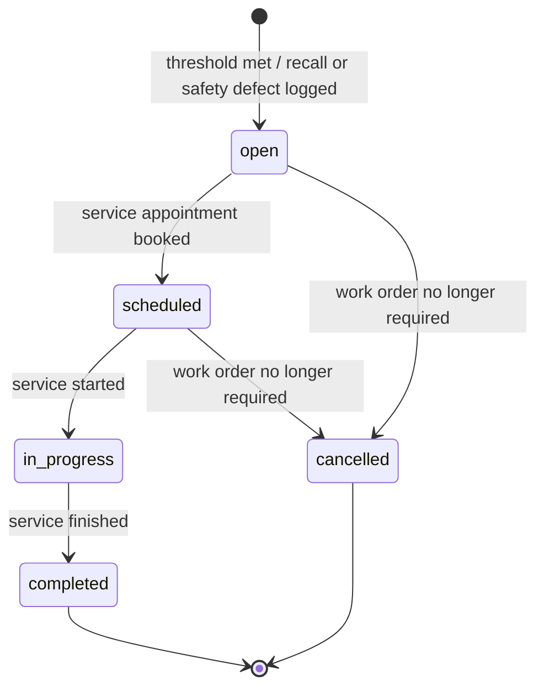
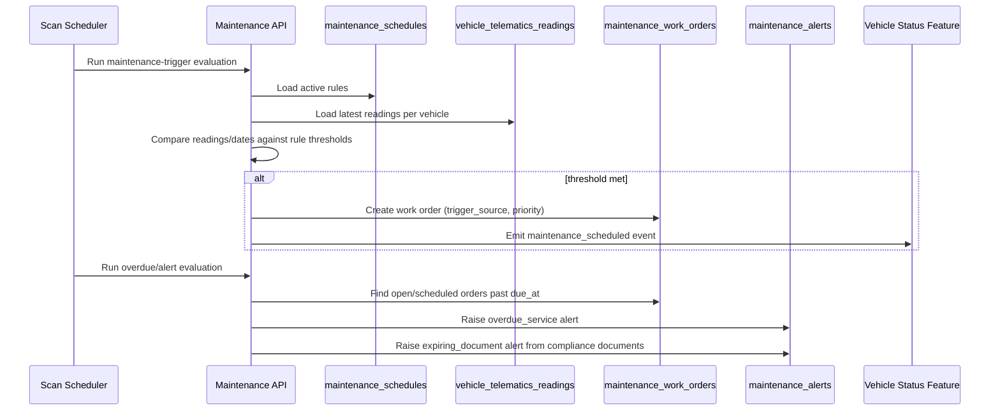

# TRD - Maintenance and Service Scheduling

## Document Information
- Feature Name: Maintenance and Service Scheduling
- Author: copilot
- Date:
- Version:

## Table of Contents
- [Background](#background)
- [In Scope](#in-scope)
- [Constraints](#constraints)
- [Technical Requirements](#technical-requirements)
- [Security Requirement](#security-requirement)
- [Non-Functional Requirements](#non-functional-requirements)
- [AI usage disclaimer](#ai-usage-disclaimer)

## Background
This TRD implements the "Schedule and Track Maintenance" requirement from the [PRD - Car Management](../prd/prd-car-management.md#schedule-and-track-maintenance). The requirement states that maintenance must be triggered and tracked based on date, mileage, telematics, or manufacturer schedule so that vehicles remain safe and compliant, that urgent repairs, recalls, and safety defects must be prioritized over routine maintenance, and that alerts must be generated for overdue service, expiring documents, and recalls.

## In Scope
- Definition of configurable maintenance-schedule rules driven by date interval, mileage interval, manufacturer-published schedule, or telematics-reported condition, at either the vehicle-category or individual-vehicle level.
- Ingestion of telematics readings (mileage, diagnostic codes, condition alerts) used to evaluate whether a maintenance-schedule rule has been met.
- Automatic generation of a maintenance work order when a schedule threshold is met.
- Manual logging of a work order for a recall or safety defect, always created with urgent priority.
- Prioritization rules ensuring urgent work orders (recalls, safety defects) are surfaced ahead of routine maintenance.
- Generation of alerts for overdue service (work orders past their `due_at`), for recalls/safety defects, and for expiring compliance documents (registration, insurance, inspection), by reading the existing compliance-document records.
- REST APIs to manage maintenance-schedule rules, submit telematics readings, query/manage work orders, and query/acknowledge/resolve alerts.

## Constraints
- Vehicle master data (VIN, plate, make/model, mileage as recorded on the vehicle record, location) is out of scope; this TRD only reads the `vehicles` record by `vehicle_id` reference, as defined in the Vehicle Onboarding and Vehicle Status & Availability TRDs.
- Automatic status transition of a vehicle into/out of `maintenance` (and the resulting removal from/return to the available pool) is out of scope; this TRD only emits the `maintenance_scheduled`/`maintenance_completed` triggering events consumed by the [Vehicle Status and Availability TRD](./trd-vehicle-status-availability.md).
- Creation, storage, and expiry evaluation of registration/insurance/inspection compliance documents is out of scope; this TRD only reads existing `vehicle_compliance_documents` records (owned by the Vehicle Status and Availability TRD) to raise expiring-document alerts.
- Telematics hardware/device integration, transport protocol, and data-ingestion pipeline details are out of scope; this TRD only defines the REST API contract through which telematics readings are submitted.
- The daily operational dashboard and general operational reporting are out of scope; this TRD only defines the alerts and work orders that dashboard depends on, as covered by the [View Operational Dashboards and Alerts](../prd/prd-car-management.md#view-operational-dashboards-and-alerts) requirement.
- Assignment of a technician/service provider, parts inventory, and service-cost tracking are out of scope; this TRD only tracks work order lifecycle status (open, scheduled, in progress, completed, cancelled).
- Whether maintenance work orders live within this system or an existing third-party service platform remains an open decision per the PRD; this TRD assumes work orders are recorded in this system's own tables and does not mandate a specific third-party integration.

## Technical Requirements

### Database Design
See [Database Design - Maintenance and Service Scheduling](./database-design-maintenance-service-scheduling.md) for the full list of tables:
- `maintenance_schedules`
- `vehicle_telematics_readings`
- `maintenance_work_orders`
- `maintenance_alerts`

This feature reuses the canonical `vehicles` table defined in [Database Design - Vehicle Status and Availability](./database-design-vehicle-status-availability.md#vehicles) and the `vehicle_categories` table defined in [Database Design - Vehicle Onboarding](./database-design-vehicle-onboarding.md#vehicle_categories); neither table is modified by this TRD.

### Backend

#### Maintenance Trigger Evaluation


- A `maintenance_work_orders` record must be created automatically whenever:
  - A vehicle's recorded mileage (from a `vehicle_telematics_readings` entry, or the vehicle's own mileage field) reaches or exceeds the `interval_mileage` since the vehicle's last completed work order for the same rule.
  - The number of days since the last completed work order for a `date_interval`/`manufacturer_schedule` rule reaches or exceeds `interval_days`, or the manufacturer schedule's next due point is reached.
  - A `condition_alert` or `diagnostic_code` telematics reading matches an active `telematics_condition` rule.
- A `maintenance_work_orders` record must be created manually, with `trigger_source` = `recall` or `safety_defect` and `priority` = `urgent`, whenever staff log a recall notice or a reported safety defect for a vehicle.
- Urgent work orders (`recall`, `safety_defect`) must always be prioritized ahead of routine (`date_interval`, `mileage_interval`, `manufacturer_schedule`, `telematics_condition`) work orders when listed or surfaced to staff.
- When a work order is created, the system must emit a `maintenance_scheduled` event (consumed by the Vehicle Status and Availability feature) carrying the `vehicle_id` and `priority`.
- When a work order transitions to `completed`, the system must emit a `maintenance_completed` event carrying the `vehicle_id`.

#### Alert Generation
1. A periodic scan reads open/scheduled `maintenance_work_orders` where `due_at` has passed and no corresponding open `maintenance_alerts` (`alert_type = 'overdue_service'`) exists for that work order; a new alert is raised with `severity = 'urgent'` if the work order's `priority` is `urgent`, otherwise `severity = 'normal'`.
2. Whenever a work order is created with `trigger_source` in (`recall`, `safety_defect`), a `maintenance_alerts` record is raised immediately with `alert_type` matching the trigger source and `severity = 'urgent'`.
3. A periodic scan reads `vehicle_compliance_documents` (owned by the Vehicle Status and Availability feature) for entries where `status = 'valid'` and `expires_at` is within a configurable lookahead window, or has already passed, and raises a `maintenance_alerts` record with `alert_type = 'expiring_document'` referencing the `compliance_document_id`, if no open alert already references that document.
4. An alert remains `open` until a staff member acknowledges it (`acknowledged_at` set, `status = 'acknowledged'`) and is marked `resolved` once the underlying work order is `completed`/`cancelled` or the compliance document is renewed/resolved.



#### REST API Specification

**1. Create/update a maintenance schedule rule**
- Method: `POST`
- URL: `/api/v1/maintenance-schedules`
- Request body:
  ```json
  {
    "vehicleCategoryId": "uuid, optional",
    "vehicleId": "uuid, optional",
    "triggerType": "date_interval",
    "intervalDays": 180,
    "intervalMileage": null,
    "manufacturerReference": null,
    "telematicsCondition": null
  }
  ```
- Response body: the created `{ id, vehicleCategoryId, vehicleId, triggerType, intervalDays, intervalMileage, manufacturerReference, telematicsCondition, active }`.

**2. List maintenance schedule rules**
- Method: `GET`
- URL: `/api/v1/maintenance-schedules`
- Query parameters: `vehicleCategoryId` (optional, UUID), `vehicleId` (optional, UUID), `active` (optional, boolean)
- Response body: paginated list of schedule rules.

**3. Submit a telematics reading**
- Method: `POST`
- URL: `/api/v1/vehicles/{vehicleId}/telematics-readings`
- Path parameter: `vehicleId` (UUID, required)
- Request body:
  ```json
  {
    "readingType": "mileage",
    "mileageValue": 45210,
    "conditionCode": null,
    "reportedAt": "ISO-8601 timestamp"
  }
  ```
- Response body: the created reading, plus `triggeredWorkOrderId` (nullable) if the reading caused a work order to be generated.

**4. Log a recall or safety defect (creates an urgent work order)**
- Method: `POST`
- URL: `/api/v1/vehicles/{vehicleId}/maintenance-work-orders`
- Path parameter: `vehicleId` (UUID, required)
- Request body:
  ```json
  {
    "triggerSource": "recall",
    "description": "string, required"
  }
  ```
- Response body: the created `{ id, vehicleId, triggerSource, priority, status, dueAt }`.

**5. List/query maintenance work orders**
- Method: `GET`
- URL: `/api/v1/maintenance-work-orders`
- Query parameters: `vehicleId` (optional, UUID), `status` (optional), `priority` (optional), `page`, `pageSize` (optional, integers)
- Response body: paginated list of work orders, ordered by `priority` (urgent first) then `dueAt` ascending.

**6. Update a maintenance work order**
- Method: `PATCH`
- URL: `/api/v1/maintenance-work-orders/{workOrderId}`
- Path parameter: `workOrderId` (UUID, required)
- Request body: any of `{ "status": "scheduled|in_progress|completed|cancelled", "scheduledAt": "ISO-8601 timestamp" }`
- Response body: the updated work order.

**7. List/acknowledge/resolve maintenance alerts**
- Method: `GET` `/api/v1/maintenance-alerts` — query parameters: `vehicleId`, `alertType`, `severity`, `status` (all optional); response is a paginated list of alerts.
- Method: `PATCH` `/api/v1/maintenance-alerts/{alertId}` — request body: `{ "status": "acknowledged|resolved" }`; response is the updated alert.

#### Common Validation Rules
- `vehicleId`/`vehicleCategoryId`/`workOrderId`/`alertId` must be valid UUIDs and must reference an existing, non-deleted record, otherwise return `404 Not Found`.
- On creating a schedule rule, exactly one of `vehicleCategoryId` or `vehicleId` must be provided, otherwise return `400 Bad Request`.
- `triggerType` must be one of the enumerated values; the field required by that type (`intervalDays`, `intervalMileage`, `manufacturerReference`, or `telematicsCondition`) must be present and, for interval fields, greater than zero, otherwise return `400 Bad Request`.
- `readingType` must be one of the enumerated values; `mileageValue` is required and must be `>= 0` when `readingType = 'mileage'`; `conditionCode` is required for the other reading types.
- `triggerSource` on the manual work-order creation endpoint must be `recall` or `safety_defect`; any other value must return `400 Bad Request`.
- `description` on the manual work-order creation endpoint is required and must be a non-empty string with a maximum length of 2000 characters.
- `status` transitions on `PATCH /maintenance-work-orders/{workOrderId}` must follow the state diagram above; any other transition must return `409 Conflict`.
- `status` transitions on `PATCH /maintenance-alerts/{alertId}` may only move from `open` to `acknowledged`, or from `open`/`acknowledged` to `resolved`; any other transition must return `409 Conflict`.

### Frontend
- Service staff must see a single prioritized work-order queue where urgent work orders (recalls, safety defects) are visually distinguished and always sorted ahead of routine maintenance.
- The vehicle detail view must display the vehicle's next-due maintenance information (whichever rule/trigger is closest to firing) alongside any open alerts for that vehicle.
- Creating a recall/safety-defect work order must require a non-empty description before the action can be submitted.
- Acknowledging or resolving an alert must be a single action available directly from the alert list, without navigating away from it.
- Any `409 Conflict` or validation error returned by the backend must be displayed inline next to the action that triggered it, not as a generic error page.

## Security Requirement
- All endpoints require authentication via JWT bearer tokens (HS256 or higher, per existing platform standard), passed in the `Authorization` request header using the `Bearer` scheme.
- The JWT payload must include `sub` (user or system-account identifier), `roles` (array of role names), `iat`, and `exp` claims.
- `GET /maintenance-schedules`, `GET /maintenance-work-orders`, and `GET /maintenance-alerts` require any authenticated staff role.
- `POST /maintenance-schedules`, `POST /vehicles/{vehicleId}/maintenance-work-orders`, `PATCH /maintenance-work-orders/{workOrderId}`, and `PATCH /maintenance-alerts/{alertId}` require the `service_staff` or `operations_manager` role.
- `POST /vehicles/{vehicleId}/telematics-readings` is restricted to trusted internal service accounts (telematics ingestion service) identified by a dedicated `roles` claim value (e.g., `system_service`); it must not be callable by end-user-facing clients.
- Every work-order and alert creation/status change must record the acting user or system account (`created_by`/`updated_by`) for audit purposes.

## Non-Functional Requirements


## AI usage disclaimer
*This document was generated with the assistance of artificial intelligence and should be reviewed by a human for accuracy and completeness.*
