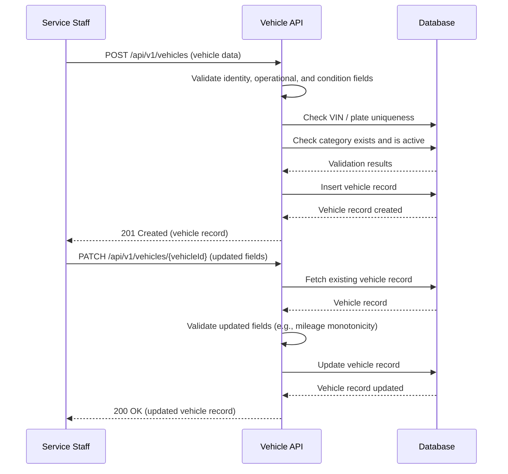

# TRD - Car Management - Vehicle Onboarding

## Document Information
- Feature Name: Car Management - Vehicle Onboarding
- Author: copilot
- Date:
- Version:

## Table of Contents
- [Background](#background)
- [In Scope](#in-scope)
- [Constraints](#constraints)
- [Technical Requirements](#technical-requirements)
- [Security Requirement](#security-requirement)
- [Non-Functional Requirements](#non-functional-requirements)
- [AI Usage Disclaimer](#ai-usage-disclaimer)

## Background
This TRD implements the functional requirement [Maintain Vehicle Master Data](../prd/prd-car-management.md#maintain-vehicle-master-data) defined in the [PRD - Car Management](../prd/prd-car-management.md). That requirement states that Service staff must be able to maintain core vehicle data (VIN, plate, make/model, mileage, fuel level, location, condition) so that the fleet's identity and condition are accurately tracked, and that vehicles must be groupable both as a specific unit and by category/class for booking purposes.

## In Scope
- Onboarding (creation) of a new vehicle record with its identity data (VIN, plate, make/model, year).
- Maintaining/updating a vehicle's operational attributes (mileage, fuel level, current location) and condition notes.
- Associating a vehicle with a vehicle category/class, so it can be referenced individually or as part of a category during booking.
- Validation rules for vehicle identity fields (e.g., VIN and plate uniqueness/format).
- REST API contract for creating, retrieving, updating, and listing vehicle master data records.

## Constraints
- Vehicle status transitions (available, reserved, rented, cleaning, maintenance, damaged, retired) and the events that trigger them are out of scope for this TRD; they are covered by a separate vehicle status/availability TRD.
- Booking/reservation logic (exact-vehicle vs. category booking, double-booking prevention) is out of scope for this TRD.
- Pickup/delivery scheduling, handover, inspection, and post-return turnaround processes are out of scope for this TRD.
- Maintenance scheduling, registration/insurance/recall tracking are out of scope for this TRD.
- Telematics integration for automatic mileage/fuel/location updates is out of scope for this TRD; only manual/API-driven updates are covered.
- Operational dashboards and alerting are out of scope for this TRD.

## Technical Requirements

### Database Design
- Contains the tables required to store vehicle master data and vehicle categories. See [Database Design - Vehicle Onboarding](./database-design-vehicle-onboarding.md) for the entity relationship diagram and table definitions.
- The `vehicles` table defined there is the single, canonical definition shared with the Vehicle-Type Booking and Vehicle Status & Availability TRDs (including the `status`/`status_since` columns owned by the latter); those TRDs must reuse it instead of redefining the table.

### Backend
The Vehicle Onboarding capability is exposed through a REST API.

#### REST API Specification

**Create Vehicle**
- Method: `POST`
- URL: `/api/v1/vehicles`
- Request Body:
  - `vin` (string, required)
  - `plate_number` (string, required)
  - `make` (string, required)
  - `model` (string, required)
  - `year` (integer, required)
  - `category_id` (string, required) — identifier of the vehicle category/class
  - `mileage` (number, required)
  - `fuel_level` (number, required) — percentage between 0 and 100
  - `location` (string, required) — current location identifier or description
  - `condition_notes` (string, optional)
- Response Body (201 Created):
  - `id` (string)
  - `vin`, `plate_number`, `make`, `model`, `year`, `category_id`, `mileage`, `fuel_level`, `location`, `condition_notes`
  - `created_at` (timestamp)

**Get Vehicle**
- Method: `GET`
- URL: `/api/v1/vehicles/{vehicleId}`
- Path Parameter: `vehicleId` (string, required)
- Response Body (200 OK): same fields as Create Vehicle response, plus `updated_at` (timestamp)

**List Vehicles**
- Method: `GET`
- URL: `/api/v1/vehicles`
- Query Parameters:
  - `category_id` (string, optional) — filter vehicles belonging to a category/class
  - `page` (integer, optional)
  - `page_size` (integer, optional)
- Response Body (200 OK): paginated list of vehicle records (same fields as Get Vehicle)

**Update Vehicle**
- Method: `PATCH`
- URL: `/api/v1/vehicles/{vehicleId}`
- Path Parameter: `vehicleId` (string, required)
- Request Body (all fields optional, only provided fields are updated):
  - `mileage`, `fuel_level`, `location`, `condition_notes`, `category_id`
- Response Body (200 OK): updated vehicle record

#### Common Validation
- `vin`: required, must be unique across all vehicles, alphanumeric, fixed length matching the standard VIN format (17 characters, excluding letters `I`, `O`, `Q`), regex-like pattern: `^[A-HJ-NPR-Z0-9]{17}$`.
- `plate_number`: required, must be unique across all active (non-retired) vehicles, alphanumeric with optional hyphen/space separators.
- `year`: required, integer, must be a valid 4-digit year not greater than the current year + 1.
- `mileage`: required on create, numeric, must be greater than or equal to 0; on update, the new value must not be lower than the previously recorded mileage.
- `fuel_level`: numeric, must be between 0 and 100 inclusive.
- `category_id`: required, must reference an existing, active vehicle category.

#### General Sequence / Algorithm

**Create Vehicle**
1. Receive the create-vehicle request.
2. Validate all required fields and formats as described in Common Validation.
3. Check that `vin` and `plate_number` are not already assigned to another vehicle.
4. Check that `category_id` refers to an existing, active category.
5. Persist the new vehicle record with the provided identity, operational, and condition data.
6. Return the created vehicle record.

**Update Vehicle**
1. Receive the update-vehicle request for a given `vehicleId`.
2. Verify the vehicle record exists.
3. Validate any provided fields as described in Common Validation (e.g., mileage cannot decrease).
4. If `category_id` is provided, verify it refers to an existing, active category.
5. Persist the updated fields on the vehicle record.
6. Return the updated vehicle record.

## Security Requirement
- All Vehicle Onboarding API endpoints require authentication via a bearer token (JWT) issued by the identity provider used across the platform.
- The JWT must be signed using an asymmetric algorithm (e.g., RS256) and validated by the API against the identity provider's public key.
- The JWT payload must include, at minimum: subject (staff user identifier), role/permissions claim (e.g., `service_staff`), issuer, audience, issued-at, and expiration claims.
- Only users with the `service_staff` role (or higher) may create or update vehicle master data; read access (Get/List) may be granted to additional roles (e.g., delivery/pickup staff, operations manager) involved in fleet operations.
- All create/update requests must be recorded in an audit trail capturing the acting user, timestamp, and changed fields, to support traceability of vehicle master data changes.

## Non-Functional Requirements

## AI Usage Disclaimer
*This document was generated with the assistance of artificial intelligence and should be reviewed by a human for accuracy and completeness.*
