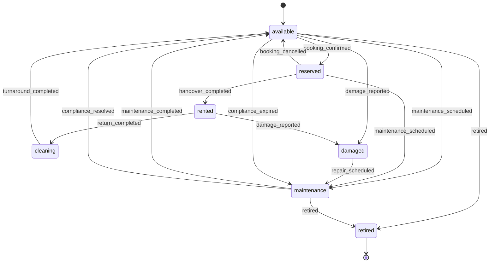
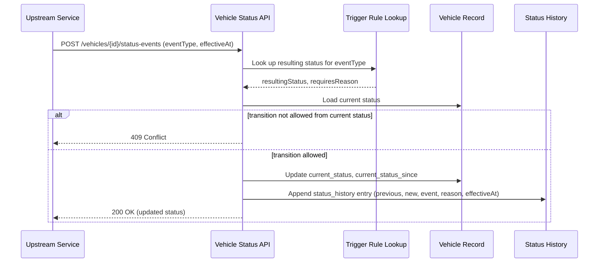

# TRD - Manage Vehicle Status and Availability

## Document Information
- Feature Name: Manage Vehicle Status and Availability
- Author: copilot
- Date:
- Version:

## Table of Contents
- [Background](#background)
- [In Scope](#in-scope)
- [Constraints](#constraints)
- [Technical Requirements](#technical-requirements)
- [Security Requirement](#security-requirement)
- [Non-Functional Requirements](#non-functional-requirements)
- [AI usage disclaimer](#ai-usage-disclaimer)

## Background
This TRD implements the "Manage Vehicle Status and Availability" requirement from the [PRD - Car Management](../prd/prd-car-management.md#manage-vehicle-status-and-availability). The requirement states that the system must track and automatically update vehicle status (available, reserved, rented, cleaning, maintenance, damaged, retired) so that only safe and available vehicles can be booked, and that triggering events (booking confirmed, handover completed, return completed, maintenance scheduled, damage reported) as well as maintenance schedules, inspections, and registration/insurance/recall conditions must be able to move a vehicle in and out of the available pool automatically.

## In Scope
- Definition of the vehicle status enumeration and the valid transitions between statuses.
- An event-driven mechanism that automatically transitions a vehicle's status when a triggering event is received (e.g., booking confirmed, handover completed, return completed, maintenance scheduled, damage reported).
- Automatic transition of a vehicle to an unavailable status when a registration, insurance, or inspection document expires, or when a recall is opened, and automatic restoration once the condition is resolved.
- A configurable mapping between trigger events and the resulting status so new event types can be onboarded without changing the transition logic.
- An append-only audit trail of every status transition, including the reason and the event that caused it.
- REST APIs to query current vehicle status/availability, query status history, and manually override status with a mandatory reason.

## Constraints
- Vehicle master data (VIN, plate, make/model, mileage, fuel level, location) is out of scope; only the `current_status` and `current_status_since` attributes of the vehicle are covered here, as defined in the Vehicle Master Data feature.
- Reservation/booking creation and double-booking prevention logic are out of scope; this TRD only consumes booking-related events (e.g., `booking_confirmed`) to drive status transitions.
- Maintenance work order scheduling logic (how/when a work order is generated) is out of scope; this TRD only consumes the `maintenance_scheduled` event to drive status transitions.
- Inspection/damage capture workflows (photos, checklists, signatures) are out of scope; this TRD only consumes the `damage_reported` event to drive status transitions.
- Post-return turnaround task management (cleaning, refueling, repair task orchestration) is out of scope; this TRD only reflects the resulting status (e.g., `cleaning`, `available`).
- Delivery/telematics hardware integration details are out of scope.

## Technical Requirements

### Database Design
See [Database Design - Vehicle Status and Availability](./database-design-vehicle-status-availability.md) for the full list of tables:
- `vehicles` (status-related columns only)
- `vehicle_status_history`
- `vehicle_compliance_documents`
- `vehicle_status_triggers`

### Backend

#### Status Enumeration and State Machine
The vehicle status must be one of: `available`, `reserved`, `rented`, `cleaning`, `maintenance`, `damaged`, `retired`.



- Any transition not explicitly defined in the `vehicle_status_triggers` configuration for the vehicle's current status must be rejected.
- A vehicle in `damaged`, `maintenance`, or `retired` status, or with an open/expired entry in `vehicle_compliance_documents`, must never be reported as available, regardless of an incoming `booking_confirmed` event.

#### REST API Specification

**1. Get current status and availability**
- Method: `GET`
- URL: `/api/v1/vehicles/{vehicleId}/status`
- Path parameter: `vehicleId` (UUID, required)
- Response body:
  ```json
  {
    "vehicleId": "uuid",
    "status": "available",
    "statusSince": "ISO-8601 timestamp",
    "available": true
  }
  ```

**2. List vehicles by status/availability**
- Method: `GET`
- URL: `/api/v1/vehicles`
- Query parameters:
  - `status` (optional, one of the enumerated statuses)
  - `categoryId` (optional, UUID)
  - `page`, `pageSize` (optional, integers, for pagination)
- Response body: paginated list of `{ vehicleId, status, statusSince, categoryId }`.

**3. Get status history**
- Method: `GET`
- URL: `/api/v1/vehicles/{vehicleId}/status-history`
- Path parameter: `vehicleId` (UUID, required)
- Query parameters: `from`, `to` (optional, ISO-8601 timestamps)
- Response body: list of `{ previousStatus, newStatus, triggerEvent, reason, effectiveAt }`, ordered by `effectiveAt` descending.

**4. Submit a triggering event (internal, system-to-system)**
- Method: `POST`
- URL: `/api/v1/vehicles/{vehicleId}/status-events`
- Path parameter: `vehicleId` (UUID, required)
- Request body:
  ```json
  {
    "eventType": "booking_confirmed",
    "effectiveAt": "ISO-8601 timestamp",
    "reason": "optional string",
    "sourceSystem": "string identifying the calling service"
  }
  ```
- Response body: the updated `{ vehicleId, status, statusSince }`, or an error if the transition is not permitted from the current status.

**5. Manually override status**
- Method: `PATCH`
- URL: `/api/v1/vehicles/{vehicleId}/status`
- Path parameter: `vehicleId` (UUID, required)
- Request body:
  ```json
  {
    "newStatus": "maintenance",
    "reason": "string, required"
  }
  ```
- Response body: the updated `{ vehicleId, status, statusSince }`.

#### Common Validation Rules
- `vehicleId` must be a valid UUID (regex: `^[0-9a-fA-F]{8}-[0-9a-fA-F]{4}-[0-9a-fA-F]{4}-[0-9a-fA-F]{4}-[0-9a-fA-F]{12}$`) and must reference an existing, non-deleted vehicle, otherwise return `404 Not Found`.
- `status`/`newStatus` must be one of the enumerated values, otherwise return `400 Bad Request`.
- `eventType` must exist in `vehicle_status_triggers`, otherwise return `400 Bad Request`.
- `reason` on the manual override endpoint must be a non-empty string with a maximum length of 500 characters.
- `effectiveAt`/`from`/`to` must be valid ISO-8601 timestamps; `from` must not be later than `to`.
- Any request attempting a transition not allowed by the state machine for the vehicle's current status must return `409 Conflict`.

#### Automatic Transition Sequence
The following sequence applies whenever an upstream service (booking, handover, maintenance, inspection, compliance monitor) reports a triggering event.



Compliance-driven transitions follow the same flow, initiated on a scheduled basis:
1. A periodic compliance scan reads `vehicle_compliance_documents` for entries where `status = 'valid'` and `expires_at` has passed, or `document_type = 'recall'` and `status = 'open'`.
2. For each match found, the scan submits a `compliance_expired` event for the affected vehicle through the same status-event flow described above.
3. When a compliance document transitions back to `resolved`/`valid`, and no other blocking condition exists, a `compliance_resolved` event is submitted to restore the vehicle to `available`.

### Frontend
- The current status, status-since timestamp, and the last five status-history entries must be visible on the vehicle detail view used by Service staff.
- Status values must be rendered with a fixed color/label mapping shared across the application (e.g., available = green, damaged = red) so staff can scan fleet state at a glance.
- The manual override action must require the staff member to select a target status from the enumerated list and to enter a reason before the action can be submitted; the reason field cannot be empty.
- Any `409 Conflict` or validation error returned by the backend must be displayed inline next to the action that triggered it, not as a generic error page.

## Security Requirement
- All endpoints require authentication via JWT bearer tokens (HS256 or higher, per existing platform standard), passed in the `Authorization` request header using the `Bearer` scheme.
- The JWT payload must include `sub` (user or system-account identifier), `roles` (array of role names), `iat`, and `exp` claims.
- `GET /vehicles/{vehicleId}/status`, `GET /vehicles`, and `GET /vehicles/{vehicleId}/status-history` require any authenticated staff role.
- `PATCH /vehicles/{vehicleId}/status` (manual override) requires the `service_staff` or `operations_manager` role.
- `POST /vehicles/{vehicleId}/status-events` is restricted to trusted internal service accounts (booking, handover/inspection, maintenance, compliance-monitor) identified by a dedicated `roles` claim value (e.g., `system_service`); it must not be callable by end-user-facing clients.
- Every status transition, whether automatic or manual, must be recorded in `vehicle_status_history` with the identifier of the acting user or system account (`created_by`) for audit purposes.

## Non-Functional Requirements


## AI usage disclaimer
*This document was generated with the assistance of artificial intelligence and should be reviewed by a human for accuracy and completeness.*
